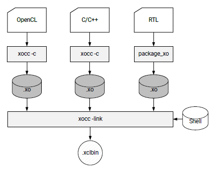

<table>
 <tr>
   <td align="center"><h1>2019.1 SDAccel™ 開発環境チュートリアル</h1>
   <a href="https://github.com/Xilinx/SDAccel-Tutorials/branches/all">その他のバージョンを表示</a>
   </td>
 </tr>
 <tr>
 <td align="center"><h1>アクセラレーションされたアプリケーションのビルドおよび実行の基本的な概念</h1>
 </td>
 </tr>
</table>

# 1\. アプリケーションのビルド

## 概要

[SDAccel 実行モデル](../sdaccel-execution-model/README.md)に示すように、アクセラレーションされたアプリケーションには、x86 サーバーで実行されるソフトウェア プログラム、および Alveo アクセラレータ カードとザイリンクス FPGA で実行されるアクセラレーションされたカーネルが含まれます。これらソースは、別々にビルド (コンパイルおよびリンク) する必要があります。その他の詳細は、『SDAccel 環境ユーザー ガイド ([UG1023](https://japan.xilinx.com/html_docs/xilinx2019_1/sdaccel_doc/itd1534452174535.html)) を参照してください。

このチュートリアルでは、ザイリンクス XCPP および XOCC コンパイラを使用してデザインのソフトウェア部分とハードウェア部分の両方をビルドする方法を説明します。ターゲット プラットフォームを指定する方法やハードウェアまたはソフトウェア エミュレーションをビルドする方法など、さまざまなコマンド ライン オプションについて説明します。

このチュートリアルで使用するリファレンス ファイルは、[./reference\_files](./reference-files) に含まれます

> **重要:** サンプル コマンドを実行する前に、『SDAccel 開発リリース ノート、インストール、およびライセンス ガイド』 ([UG1238](https://japan.xilinx.com/html_docs/xilinx2019_1/sdaccel_doc/yrc1534452173645.html)) で説明するように、次のコマンドを実行して SDx ツール、プラットフォーム、およびランタイムを設定するようにしてください。
>
> ```bash
>  #setup Xilinx SDx tools. XILINX_SDX and XILINX_VIVADO will be set in this step.
>  source <SDX_install_path>/settings64.sh
>  #Setup Xilinx runtime. XILINX_XRT will be set in this step.
>  source <XRT_install_path>/setup.sh
> ```

## ソフトウェアのビルド

ソフトウェア プログラムは C/C++ で記述され、OpenCL™ API 呼び出しを使用してアクセラレーションされたカーネルとの通信および制御します。これは、標準 GCC コンパイラや XCPP ユーティリティ (GCC 周辺のラッパー) を使用してビルドされます。  各ソース ファイルはオブジェクト ファイル (.o) にコンパイルされ、ザイリンクス ランタイム (XRT) 共有ライブラリとリンクされて、実行ファイルが作成されます。GCC および関連するコマンド ライン オプションの詳細は、[GNU コンパイラ コレクション (GCC) の使用](https://gcc.gnu.org/onlinedocs/gcc/)を参照してください。

1. **ソフトウェア プログラムのコンパイル**

   ホスト アプリケーションをコンパイルするには、`-c` オプションにホスト ソース ファイルのリストを付けます。  
オプションで、出力オブジェクト ファイル名を `-o` オプションで指定することもできます。

   ```bash
   xcpp ... -c <source_file_name1> ... <source_file_nameN> -o <object_file_name> -g
   ```

2. **ソフトウェア プログラムのリンク**

   生成したオブジェクト ファイルをリンクするには、次のように `-l` オプションとオブジェクト入力ファイルを使用します。

   ```bash
   xcpp ... -l <object_file1.o> ... <object_fileN.o> -o <output_file_name>
   ```

   > **ヒント:** ホスト コンパイルおよびリンクは、1 つにまとめることができます。この場合、`-c` および `-l` オプションは必要なく、ソース入力ファイルだけが必要です。
   >
   > `xcpp ... <source_file_name1> ... <source_file_nameN> ... -o <output_file_name>`

3. **必須のフラグ**

   XRT および Vivado ツールのインクルード パスとライブラリ パスを指定する必要があります。

   1. `-I` オプションを使用してインクルード ディレクトリを `-I$XILINX_XRT/include -I$XILINX_VIVADO/include` と指定します。
   2. `-L` オプションを使用して `-l` ライブラリを検索するディレクトリを `-L$XILINX_XRT/lib` と指定します。
   3. `-l` オプションを使用してリンク中に使用されるライブラリを `-lOpenCL -lpthread -lrt -lstdc++` と指定します。

4. **すべてのコマンド**

   ホスト プログラムを `./reference_files/run` から 1 つのステップでビルド、リンク、コンパイルするすべてのコマンドは、次のようになります。

   ```bash
   $XILINX_SDX/bin/xcpp -I$XILINX_XRT/include/ -I$XILINX_VIVADO/include/ -Wall -O0 -g -std=c++14 \
   ../src/host.cpp  -o 'host'  -L$XILINX_XRT/lib/ -lOpenCL -lpthread -lrt -lstdc++
   ```

   > **コマンド オプションおよび説明**
   >
   > * `-I../libs`: ディレクトリを含有:
   > * `-I$XILINX_XRT/include/`: ディレクトリを含有
   > * `-I$XILINX_VIVADO/include/`: ディレクトリを含有
   > * `-Wall`: 警告をすべてイネーブル
   > * `-O0`: 最適化オプション (最後の最適化を実行)
   > * `-g`: デバッグ情報を生成
   > * `-std=c++14`: 言語規格 (インクルード ディレクトリではなく、C++ 規格を定義)
   > * `../src/host.cpp`: ソース ファイル
   > * `-o 'host'`: 出力名
   > * `-L$XILINX_XRT/lib/`: XRT ライブラリを検索
   > * `-lOpenCL`: リンク中に該当ライブラリを検索
   > * `-lpthread`: リンク中に該当ライブラリを検索
   > * `-lrt`: リンク中に該当ライブラリを検索
   > * `-lstdc++`: リンク中に該当ライブラリを検索

## ハードウェアのビルド

次に、ハードウェア アクセラレータ カードで実行されるカーネルをビルドする必要があります。  カーネルのビルドは、ホスト アプリケーションのビルドと同様、コンパイルおよびリンクする必要があります。ハードウェア カーネルは C/C++、OpenCL C、または RTL で記述できます。C/C++ および OpenCL C カーネルは、XOCC コンパイラを使用してコンパイルされますが、RTL で記述されたカーネルはザイリンクスの `package_xo` ユーティリティを使用してコンパイルされます。

`xocc` および `package_xo` 両方の詳細は、『SDx コマンドおよびユーティリティ リファレンス ガイド ([UG1279](https://japan.xilinx.com/html_docs/xilinx2019_1/sdaccel_doc/ckx1534452174973.html)) を参照してください。カーネルのコンパイル方法に関係なく、どちらの方法でもザイリンクス オブジェクト ファイル (XO) が生成されます。

オブジェクト ファイルは、FPGA バイナリ ファイルまたは xclbin ファイルを作成するために、後で `xocc` を使用してシェル (ハードウェア プラットフォーム) とリンクされます。

次の図は、さまざまなコード記述されたハードウェア カーネルのコンパイルおよびリンク フローを示しています。  


このチュートリアルでは、'xocc' コンパイルに限定して説明をし、RTL カーネルについては説明しません。RTL カーネルのビルド方法については、[RTL カーネル入門](../getting-started-rtl-kernels/README.md)チュートリアルを参照してください。

### ハードウェア コンパイル

ハードウェア コンパイルでは、XOCC の `-c` コンパイラ オプションを使用してハードウェア カーネルのソース ファイルをコンパイルします。XOCC には多くのコマンド オプションがありますが、最低でもソース ファイル、ターゲット プラットフォーム、ビルド ターゲットを指定する必要があります。すべての XOCC オプションについては、『SDx コマンドおよびユーティリティ リファレンス ガイド ([UG1279](https://japan.xilinx.com/html_docs/xilinx2019_1/sdaccel_doc/ckx1534452174973.html)) を参照してください。

オプションで `-k` または `--kernel` 引数を使用すると、コンパイルするカーネル ソース ファイル内のカーネル名を指定できます。

`xocc … -k <kernel_name> <kernel_source_file> … <kernel_source_file>`

ターゲット プラットフォームは、コンパイルとリンクの両方の段階で指定する必要があります。これは、次のように `--platform` オプションを使用して指定します。

`xocc … --platform <platform_target>`

最後に、`-t` オプションを使用してビルド ターゲットを `xocc … -t <build_target>` のように指定します。

ビルド ターゲットには、デバッグおよび検証に使用する 2 つのエミュレーション ターゲット、および FPGA で実行する必要のある実際のバイナリを生成するのに使用されるハードウェア ターゲット 1 つの合計 3 つがあります。

これらのビルド ターゲットの設定オプションは次のとおりです。

* `xocc … -t sw_emu`
* `xocc … -t hw_emu`
* `xocc … -t hw`

ソフトウェア エミュレーション (`sw_emu`) では、ホスト アプリケーション コードとカーネル コードの両方が x86 プロセッサで実行できるようコンパイルされます。これにより、高速なビルドおよび実行ループを使用した反復アルゴリズムによる改善が可能になります。このターゲットは、構文エラーを特定し、アプリケーションと共に実行されるカーネル コード ソース レベルのデバッグを実行し、システムの動作を検証するのに便利です。  RTL カーネルでは、C モデルが関連付けられている場合にソフトウェア エミュレーションがサポートされます。  C モデルが使用可能でない場合は、ハードウェア エミュレーションを使用してカーネル コードをデバッグする必要があります。

ハードウェア エミュレーション (`hw_emu`) では、カーネル コードがハードウェア モデル (RTL) にコンパイルされ、専用シミュレータで実行されますが、残りのシステムは C シミュレータが使用されます。ビルドおよび実行にかかる時間は長くなりますが、詳細でサイクル精度の高いカーネル アクティビティが表示されます。このターゲットは、FPGA に含まれるロジックの機能をテストして、最初のパフォーマンス見積もりを取得する場合に便利です。

最後に、ターゲットがシステム (`hw`) に設定される場合、FPGA で実行するバイナリを生成するためにカーネル コードが合成されてコンパイルされます。

次のコマンドは、`./reference_files/run` フォルダーからカーネルをソフトウェア エミュレーション ターゲットにコンパイルします。

```bash
xocc -t sw_emu --platform xilinx_u200_xdma_201830_1 -g -c -k mmult -I'../src' -o'mmult.sw_emu.xilinx_u200_xdma_201830_1.xo' '../src/mmult.cpp'
```

> **コマンド オプションおよび説明**
>
> * `-c`: カーネルをコンパイル
> * `-g`: デバッグ情報を生成
> * `--platform xilinx_u200_xdma_201830_1`: xilinx\_u200 プラットフォームをターゲットに指定
> * `-t sw_emu`: ソフトウェア エミュレーションをターゲットに指定
> * `-k mmult`: カーネル名を krnl\_vadd に指定
> * `../src/mmult.cpp`: ソース ファイルを指定
> * `-o mmult.sw_emu.xilinx_u200_xdma_201830_1.xo`: XO 出力ファイル名を指定

### ハードウェア リンク

ハードウェア リンク中は、1 つまたは複数のカーネルをプラットフォームにリンクして、出力バイナリ コンテナーの xclbin ファイルを作成します。ハードウェア カーネルをリンクするには、XOCC `-l` オプションが使用されます。コンパイルと同様、リンクには XO オブジェクト ファイル、プラットフォーム、およびビルド ターゲットの指定などの複数のオプションを指定する必要があります。使用可能なリンク オプションは、『SDx コマンドおよびユーティリティ リファレンス ガイド』 ([UG1279](https://japan.xilinx.com/html_docs/xilinx2019_1/sdaccel_doc/ckx1534452174973.html)) を参照してください。リンク中に使用されるプラットフォームおよびビルド ターゲット オプションは、コンパイル中に使用されるものと同じである必要があります。

XO オブジェクト ファイルは、オブジェクト ファイルを直接リストして xocc コマンドで指定します。複数のオブジェクト ファイルを追加できます。

`xocc … <kernel_xo_file.xo> … <kernel_xo_file.xo>`

リンク プロセス中に作成するカーネル インスタンス (計算ユニット (CU)) の数を指定することもできます。カーネルのインスタンスは `--nk` オプションを使用して xclbin ファイルで指定できます。

`xocc ... --nk <kernel_name>:<compute_units>:<kernel_name1>:…:<kernel_nameN>`

> **ヒント:** インスタンス名 (\`kernel\_name1...') はオプションで、指定しない場合は自動的に定義されます。

`-o` オプションを使用して生成される出力ファイルの名前を指定することもできます。リンク段階の出力ファイルは xclbin ファイルで、適宜名前を付ける必要があります。

`xocc ... -o <xclbin_name>.xclbin`

では、ハードウェアをリンクします。前と同様、ハードウェア コンパイル段階のターゲットと同じになるようにプラットフォームとターゲットを指定する必要があります。次のコマンドを実行します。

```bash
xocc -t sw_emu --platform xilinx_u200_xdma_201830_1 -g -l --nk mmult:1:mmult_1 -o'mmult.sw_emu.xilinx_u200_xdma_201830_1.xclbin' mmult.sw_emu.xilinx_u200_xdma_201830_1.xo
```

> **コマンド オプションおよび説明**
>
> * `-l`: カーネルをリンク
> * `-g`: デバッグ情報を生成
> * `--platform xilinx_u200_xdma_201830_1`: プラットフォームを指定
> * `-t sw_emu`: ソフトウェア エミュレーションをターゲットに指定
> * `--nk mmult:1:mmult_1`: mmult\_1 という 1 つの CU を作成
> * `mmult.sw_emu.xilinx_u200_xdma_201830_1.xo`: 入力オブジェクト ファイル
> * `-o mmult.sw_emu.xilinx_u200_xdma_201830_1.xclbin`: XCLBIN 出力ファイル名を指定

### ハードウェア エミュレーションおよびハードウェア システムのビルド

「ハードウェア エミュレーション」または Alveo アクセラレータ カード「システム」をターゲットにしたハードウェアをビルドするには、\<*build\_target*> を定義する `-t` オプションを、ハードウェア エミュレーションの場合は **sw\_emu** から **hw\_emu** に、アクセラレータ カード用にビルドする場合は **hw** に変更します。

「ハードウェア エミュレーション」と「システム」ビルド ターゲットの両方に対してコンパイルおよびリンクする XOCC コマンドは、次のとおりです。

* **ハードウェア エミュレーション ビルド**

  ```bash
  xocc -t hw_emu --platform  xilinx_u200_xdma_201830_1 -g -c -k mmult -I'../src' -o'mmult.hw_emu.xilinx_u200_xdma_201830_1.xo' '../src/mmult.cpp'
    xocc -t hw_emu --platform xilinx_u200_xdma_201830_1 -g -l --nk mmult:1:mmult_1 -o'mmult.hw_emu.xilinx_u200_xdma_201830_1.xclbin' mmult.hw_emu.xilinx_u200_xdma_201830_1.xo
  ```

* **システム ビルド**

  > **重要:** FPGA バイナリ ファイルの合成およびインプリメンテーションのため、ハードウェア ターゲット用のコンパイルしてリンクするにはかなり時間がかかります。

  ```bash
     xocc -t hw --platform xilinx_u200_xdma_201830_1 -c -k mmult -I'../src' -o'mmult.hw.xilinx_u200_xdma_201830_1.xo' '../src/mmult.cpp'
     xocc -t hw --platform xilinx_u200_xdma_201830_1 -l --nk mmult:1:mmult_1 -o'mmult.hw.xilinx_u200_xdma_201830_1.xclbin' mmult.hw.xilinx_u200_xdma_201830_1.xo
  ```

### ハードウェア ビルド レポートの確認

コンパイル段階とリンク段階の両方で HTML ベースのガイダンス レポートが生成されます。レポートには、コンパイル/リンクに使用されたコマンド、レポート サマリ、違反などがリストされます。

「ハードウェア エミュレーション」および「システム ビルド」ターゲット ビルドの場合は、`system_estimate_<kernel_name>.<build_target>.<dsa_name>.xtxt` レポート ファイルもコンパイル段階とリンク段階の両方で自動的に生成されます。このレポートには、FPGA リソース使用量の見積もりと、ハードウェアでアクセラレーションされたカーネルの周波数の見積もりが示されます。

* コンパイル レポートは、次のディレクトリに含まれます。

  ```
  ./_x/reports/<kernel_name>.<build_target>.<dsa_name>
  ```

* リンク レポートは、次のディレクトリに含まれます。

  ```
  ./_x/reports/link
  ```

レポートを開くには、ディレクトリをそのディレクトリに変更して、HTML ガイダンス レポートを開きます。ターゲット ビルドが hw\_emu または system builds の場合、ターゲットにされたビルドがテキスト エディターで XTXT ファイルを開きます。

* 次の図は、ハードウェア コンパイルの HTML レポートの例を示しています。リンク中にも同様のレポートが生成されます。

  

* 次の図は、`./_x/reports/links` フォルダーに含まれる `system_estimate.xtxt` コンパイル レポートの例を示しています。リンク中にも同様のレポートが生成されます。

  

### まとめ

次の手順は、この演習のソース ファイルを使用してソフトウェア エミュレーションをターゲットにしたソフトウェアおよびハードウェア両方をビルドする方法をまとめています。

1. SDx ツール、プラットフォーム、およびランタイムを設定します。

   ```bash
   #setup Xilinx SDx tools, XILINX_SDX and XILINX_VIVADO will be set in this step. source <SDX install path>/settings64.sh. for example:
   source /opt/Xilinx/SDx/2019.1/settings64.sh
   #Setup runtime. XILINX_XRT will be set in this step
   source /opt/xilinx/xrt/setup.sh
   #change to the working directory
   cd ./reference-files/run
   ```

2. ホスト ソフトウェアをビルドします。

   ```bash
   xcpp -I$XILINX_XRT/include/ -I$XILINX_VIVADO/include/ -Wall -O0 -g -std=c++14 ../src/host.cpp  -o 'host'  -L$XILINX_XRT/lib/ -lOpenCL -lpthread -lrt -lstdc++
   ```

3. ハードウェアをビルドします。ターゲット (ソフトウェア エミュレーション、ハードウェア エミュレーション、またはシステム) を選択して、関連コマンドを実行します。

   * 「ソフトウェア エミュレーション」をターゲットにした場合

   ```bash
   xocc -t sw_emu --platform xilinx_u200_xdma_201830_1 -g -c -k mmult -I'../src' -o'mmult.sw_emu.xilinx_u200_xdma_201830_1.xo' '../src/mmult.cpp'
   xocc -t sw_emu --platform xilinx_u200_xdma_201830_1 -g -l --nk mmult:1:mmult_1 -o'mmult.sw_emu.xilinx_u200_xdma_201830_1.xclbin' mmult.sw_emu.xilinx_u200_xdma_201830_1.xo
   ```

   * 「ハードウェア エミュレーション」をターゲットにした場合

   ```bash
   xocc -t hw_emu --platform  xilinx_u200_xdma_201830_1 -g -c -k mmult -I'../src' -o'mmult.hw_emu.xilinx_u200_xdma_201830_1.xo' '../src/mmult.cpp'
   xocc -t hw_emu --platform xilinx_u200_xdma_201830_1 -g -l --nk mmult:1:mmult_1 -o'mmult.hw_emu.xilinx_u200_xdma_201830_1.xclbin' mmult.hw_emu.xilinx_u200_xdma_201830_1.xo
   ```

   * 「システム」をターゲットにした場合

   ```bash
   xocc -t hw --platform xilinx_u200_xdma_201830_1 -c -k mmult -I'../src' -o'mmult.hw.xilinx_u200_xdma_201830_1.xo' '../src/mmult.cpp'
   xocc -t hw --platform xilinx_u200_xdma_201830_1 -l --nk mmult:1:mmult_1 -o'mmult.hw.xilinx_u200_xdma_201830_1.xclbin' mmult.hw.xilinx_u200_xdma_201830_1.xo
   ```

## 次のステップ

問題なくデザインを構築できたら、エミュレーションを実行してデバッグおよび最適化します。

* ソフトウェアおよびハードウェア エミュレーションの実行方法は、[ソフトウェアおよびハードウェア エミュレーションの実行](./Emulation.md)を参照してください。
* ザイリンクス Alveo カードをお持ちの場合は、[ハードウェアでの実行](./HardwareExec.md)演習に進んで、ハードウェアで直接アプリケーションを実行することもできます。

</br>
<hr/>
<p align= center><b><a href="../../README.md">メイン ページに戻る</a> — <a href="../sdaccel-getting-started/README.md">入門コースの初めに戻る</a></b></p>
<p align="center"><sup>Copyright&copy; 2019 Xilinx</sup></p>
