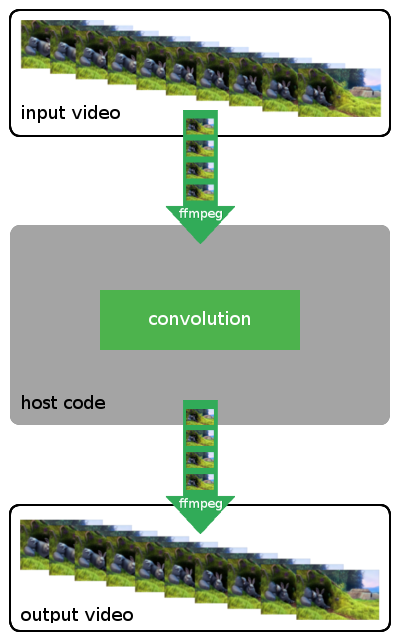

<table>
 <tr>
   <td align="center"><h1>2019.1 SDAccel™ 開発環境チュートリアル</h1>
   <a href="https://github.com/Xilinx/SDAccel-Tutorials/branches/all">See other versions</a>
   </td>
 </tr>
 <tr>
 <td align="center"><h1>アクセラレーションされた FPGA アプリケーションの最適化手法
 </td>
 </tr>
</table>

# 1\. 元のアプリケーションの評価

このチュートリアルで使用される C アプリケーションは、提供されているフィルター係数と RGBA ビデオのセットの 2D たたみ込みを実行します。アプリケーションは ffmpeg を使用して入力および出力ビデオ ストリームを作成します。これが入力ビデオの各フレームを読み込んで該当する処理済フレームに書き出すためのパイプとして使用されます。



この手順では、このアプリケーションをビルドして実行し、アクセラレーション前の元のアプリケーションの基準となるパフォーマンス データを作成します。元のアプリケーションの出力はゴールデン データとしても保存し、ハードウェア アクセラレーションされたアプリケーションの出力と比較して検証するために使用します。

## C アプリケーションのビルド

1. 元のアプリケーション コードを含む `cpu_src` ディレクトリに移動します。

2. 次の `make` コマンドを実行します。

   ```
   cd convolution-tutorial/design/cpu_src
   make
   ```

このコマンドを実行すると、C ソース コードがコンパイルされ、`convolve` 実行ファイルが作成されます。実行ファイルには、ビデオ ファイル (この場合はプロジェクト ルート ディレクトリにあります) へのパスが必要です。

> **ヒント:** この演習で使用される makefile には、多くの手順と変数が含まれます。makefile の構造および内容については、[makefile の理解](./HowToRunTutorial.md)を参照してください。

## C アプリケーションの実行とゴールデン結果の生成

この手順では、次のコマンドで元の C アプリケーションを別の形式の指定された入力ビデオ ファイルを使用して実行して、比較目的のゴールデン出力ファイルを生成します。

```
cd convolution-tutorial/design/cpu_src
make golden
```

生成された最初の出力ファイル `golden_out_full.mp4` は 132 フレームのフル動画で、各フレームは 1980x1080 ピクセルです。このゴールデン出力ファイルは、アプリケーションがハードウェアでかなりすばやく実行できるので、すべてのハードウェア実行に使用されますが、エミュレーションの場合は、よりすばやく結果を出すために、1 つのフレームのみを含む小さなファイルを使用します。

次は、生成されたゴールデン出力ファイルのサマリです。

- `golden_out_full.mp4`: ハードウェアで実行される場合のアクセラレーションされたアプリケーションのテストに使用。
- `golden_out_small.mp4`: 「手順 5: 順不同キューと複数の計算ユニットの使用」以外のソフトウェアおよびハードウェア エミュレーション実行のテストに使用。
- `golden_out_small_40.mp4`: 「手順 5: 順不同キューと複数の計算ユニットの使用」のテストに使用。

## アプリケーションのプロファイルとパフォーマンス目標の決定

『SDAccel 設計手法ガイド』 ([UG1346](https://japan.xilinx.com/support/documentation/sw_manuals/xilinx2019_1/ug1346-sdaccel-methodology-guide.pdf)) で説明するように、`gprof` ツールを使用すると、アプリケーションをプロファイリングして、アクセラレーション可能な関数を見つけることができます。

1. gcc コマンド ラインに `-pg` オプションを追加します。これには既に `Makefile` に含まれています。

2. ディレクトリを `cpu_src` フォルダーに変更して、`make` で実行ファイルを生成します。

   ```
   cd cpu_src
   ```

3. 実行ファイルを実行します。

   ```
   ./convolve --gray true ../video.mp4
   ```

4. プロファイル結果を抽出します。

   ```
   gprof convolve gmon.out> gprofresult.txt
   ```

5. プロファイル サマリ レポートを表示するには、テキスト エディターで `gprofresult.txt` ファイルを開きます。次の表のような結果になるはずです。

   各サンプルは 0.01 秒でカウントされます。

   | 時間の割合 (%)| 累積秒数| それだけの秒数| 呼び出し合計| ms/呼び出し| ms/呼び出し| 名前
   |----------:|----------:|----------:|----------:|----------:|----------:|:----------
   | 95.29| 7.28| 7.28| 132| 55.15| 55.15| convolve\_cpu
   | 4.85| 7.65| 0.37| 132| 2.81| 2.81| grayscale\_cpu
   | 0.00| 7.65| 0.00| 132| 0.00| 0.00| print\_progress(int, int)
   | 0.00| 7.65| 0.00| 1| 0.00| 0.00| GLOBAL\_\_sub\_I\_default\_output

   レポートには、convolve\_cpu に実行時間の 95% が使用されていることが示されますので、この関数をアクセラレーションすると、パフォーマンス全体がかなり改善することになります。

### 達成可能な最大スループットの判断

ほとんどの FPGA アクセラレーション システムで、達成可能な最大スループットは PCIe® バスによって制限されます。PCIe のパフォーマンスは、マザーボード、ドライバー、ターゲット シェル、転送サイズなどのさまざまな要因の影響を受けます。SDAccel 環境に含まれる `xbutil` ユーティリティを使用して `xbutil dmatest` コマンドを実行すると、達成可能な最大 PCIe 帯域幅を測定できます。デザイン ターゲットのスループットは、この上限を超えることができません。

### 全体的なアクセラレーション目標の設定

CPU では、1 つの 1080 p フレームを処理するのに 55.15 ms かかります。これは、つまり毎秒 1000/55.15 = 18.13 フレームのパフォーマンスを達成していることを意味します。目標はアプリケーションが 30fps の最小のリアルタイム パフォーマンスを達成することなので、CPU と比べて ~2x の係数でアクセラレーションする必要があります。

フレームのサイズが 1920 x 1080 x 4 バイト = 8.29 MB だとすると、アクセラレーションされたアプリケーションの最小スループットは 8.29 MB x 30 fps = 249 MB/s になります。

このスループット目標は、Alveo カードの最大の達成可能なスループットの範囲内になります。このチュートリアルでは、この目標を達成するプロセスをお見せします。

## 次のステップ

ここまでで、元のアプリケーションからアクセラレーションする関数を見つけて、パフォーマンス目標を作成しました。次の演習では、元の `convolve` 関数のベースラインを作成してハードウェアで実行し、一連のホストおよびカーネル コード最適化を実行して、パフォーマンス目標を満たします。これは、元のアプリケーションから [SDAccel アプリケーションを作成](./baseline.md)するところから開始します。

ハードウェア エミュレーションを使用して、各ステップのパフォーマンスを測定します。最後に、これらすべてをハードウェアで実行して、パフォーマンスが各ステップでどれだけ改善されたかを確認します。

</br>
<hr/>
<p align= center><b><a href="../../README.md">メイン ページに戻る</a> — <a href="../sdaccel-getting-started/README.md">入門コースの初めに戻る</a></b></p>
<p align="center"><sup>Copyright&copy; 2019 Xilinx</sup></p>
