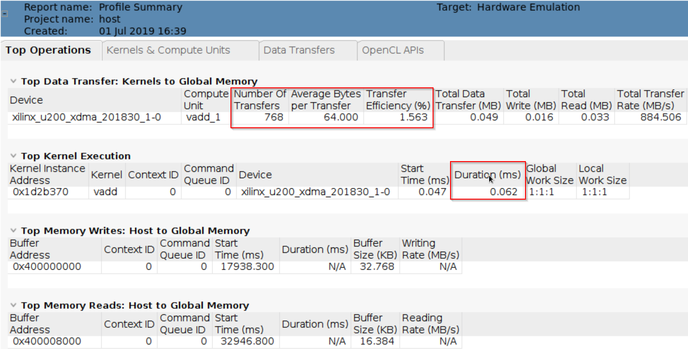
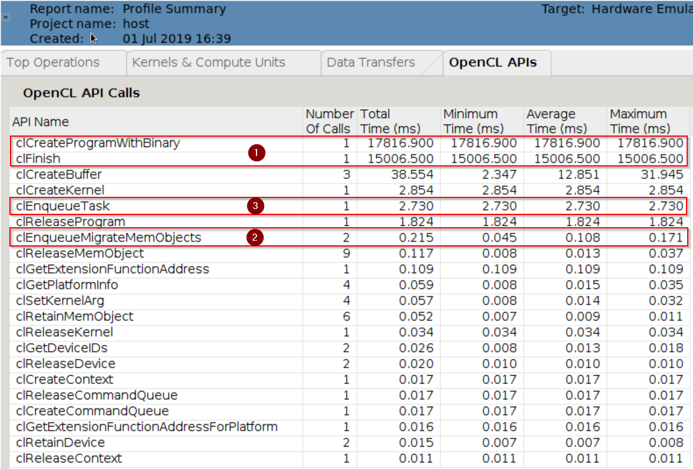
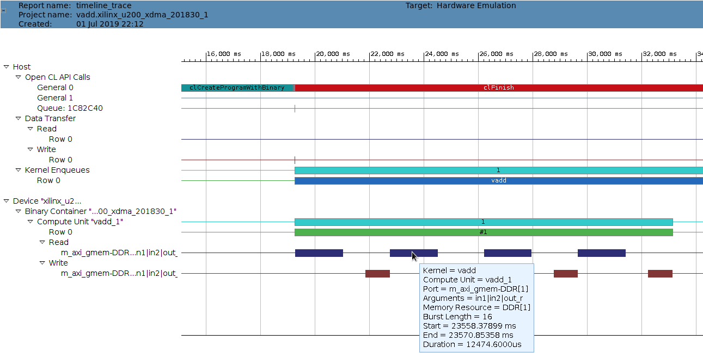
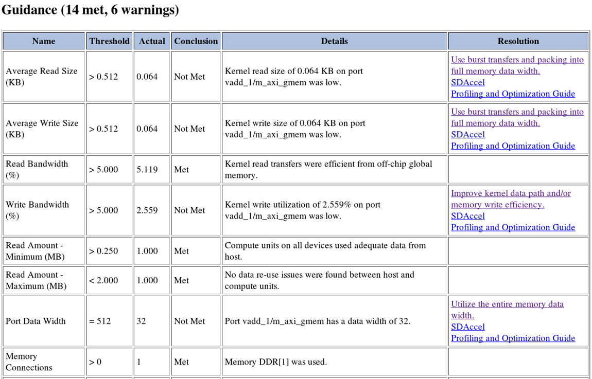

<table>
 <tr>
   <td align="center"><h1>2019.1 SDAccel™ 開発環境チュートリアル</h1>
   <a href="https://github.com/Xilinx/SDAccel-Tutorials/branches/all">その他のバージョンを表示</a>
   </td>
 </tr>
 <tr>
 <td align="center"><h1>はじめての SDAccel プログラムの作成</h1>
 </td>
 </tr>
</table>

# 4\. アプリケーションのプロファイリング

SDAccel™ 環境では、コンパイル中にカーネルのリソースとパフォーマンスに関するさまざまなレポートが生成されます。また、エミュレーション モードおよび FPGA アクセラレーション カードでアプリケーション実行中のプロファイリング データも収集されます。この演習では、レポートを生成して、プロファイリング結果を収集して SDAccel 環境に表示する方法を説明します。

## プロファイル サマリ

SDAccel 環境ランタイムはホスト アプリケーションで自動的にプロファイリング データを収集します。アプリケーションが実行を終了すると、ソリューション レポートまたは作業ディレクトリ内にプロファイル サマリが HTML、CSV および Google Protocol Buffer フォーマットで保存されます。これらのレポートはウェブ ブラウザー、スプレッドシート ビューアー、または SDAccel 環境の \[Profile Summary] ビューで表示できます。

1. プロファイル モニタリングを有効にするには、`profile=true` にして [`sdaccel.ini`](../Pathway3/ProfileAndTraceReports.md#create-the-sdaccelini-file) ファイルを作成します。このファイルは、実行ディレクトリ内に含める必要があります。

   ```
   [Debug]
   profile=true
   timeline_trace=true
   data_transfer_trace=fine
   ```

2. ハードウェア エミュレーションのプロファイル サマリ レポートを生成するには、ハードウェア リンク段階で `--profile_kernel` オプションを使用してカーネルをビルドします。これにより、エミュレーション中にパフォーマンス データが収集できるようになります。

   ```
   xocc -t hw_emu --platform xilinx_u200_xdma_201830_1 -g -c -k vadd -I'../src' -o'vadd.xilinx_u200_xdma_201830_1.xo' './src/vadd.cpp'
   xocc -t hw_emu --platform xilinx_u200_xdma_201830_1 -g -l --nk vadd:1:vadd_1 --profile_kernel data:all:all:all -o'vadd.xilinx_u200_xdma_201830_1.xclbin' vadd.xilinx_u200_xdma_201830_1.xo
   ```

3. プロファイル サマリを表示するには、CSV ファイルをスプレッドシート ツールで開くか、[sdx\_analyze ユーティリティ](../Pathway3/ProfileAndTraceReports.md#view-the-profile-summary)を使用してデータを HTML レポート形式に変換します。

   ```bash
   sdx_analyze profile -f html -i ./profile_summary.csv
   firefox profile_summary.html
   ```

   次の図は、SDAccel GUI で生成されたプロファイル サマリ レポートを示しています。

   ```bash
   sdx_analyze profile -i ./profile_summary.csv
   sdx -workspace ./tmp -report profile_summary.xprf
   ```

   

   プロファイル サマリには、どのアプリケーションにも役立つさまざまな統計が含まれます。注意するべき重要な点は、前の図でハイライトされています。このサマリには、アプリケーションの機能的なボトルネックの概要が表示されます。

4. レポートの「Kernel to Global Memory」セクションを確認してください。データ転送の数と毎転送の平均バイトがわかります。

5. 「Top Kernel Execution」セクションの \[Duration] 列には、ハードウェア エミュレーション/ハードウェアでカーネルを実行するのにかかった時間が表示されます。

6. 次に、プロファイル レポートの **\[OpenCL APIs]** タブをクリックします。呼び出し数および呼び出しの時間など、さまざまな OpenCL API 呼び出しに関する詳細が表示されます。

   

前の図は、データ転送にハイレベルなシミュレーション モードを使用するハードウェア エミュレーションからのものです。ほとんどのアプリケーション時間がハイライトされている呼び出し (`clProgramWithBinary`、`clEnqueueMigrateMemObjects`、および `clEnqueueTask`) で費やされていることがわかります。ハードウェアで実行する際は、上記のハイライトされている統計を確認することをお勧めします。

## アプリケーション タイムライン トレース

アプリケーション タイムラインは、ホストとデバイスのイベント情報を収集し、共通のタイムラインに表示します。これは、システムの全体的な状態とパフォーマンスを視覚的に表示して理解するのに役立ちます。これらのイベントには、次のものがあります。

* ホスト コードからの OpenCL API 呼び出し。
* AXI トランザクションの開始/停止、カーネルの開始/停止を含むデバイス トレース データ。

1. 集めたタイムライン トレース情報を有効にするには、`timeline_trace=true` および `data_transfer_trace=fine` に設定して [`sdaccel.ini`](../Pathway3/ProfileAndTraceReports.md#create-the-sdaccelini-file) ファイルを 作成します。

   ```
   [Debug]
   profile=true
   timeline_trace=true
   data_transfer_trace=fine
   ```

2. ハードウェア エミュレーションのタイムライン トレース レポートを生成するには、ハードウェア リンク段階で `--profile_kernel` オプションを使用してカーネルをビルドします (まだ実行していない場合のみ)。

   ```
   xocc -t hw_emu --platform xilinx_u200_xdma_201830_1 -g -c -k vadd -I'../src' -o'vadd.xilinx_u200_xdma_201830_1.xo' './src/vadd.cpp'
   xocc -t hw_emu --platform xilinx_u200_xdma_201830_1 -g -l --nk vadd:1:vadd_1 --profile_kernel data:all:all:all -o'vadd.xilinx_u200_xdma_201830_1.xclbin' vadd.xilinx_u200_xdma_201830_1.xo
   ```

3. タイムライン トレースは、[sdx\_analyze ユーティリティ](../Pathway3/ProfileAndTraceReports.md#view-the-timeline-trace)を使用して CSV を WDB 形式に変換して、GUI で表示します。

   ```bash
   sdx_analyze trace -f wdb -i ./timeline_trace.csv
   sdx -workspace ./tmp -report timeline_trace.wdb
   ```

   次の図は、生成されたタイムライン トレース レポートを示しています。

   

4. \[Timeline Trace] ビューで Read/Write データ転送を示す横棒にカーソルを置くと、バースト長、DDR メモリ リソース、転送時間などの情報がさらに表示されます。

## \[Guidance] ビュー

\[Guidance] ビューは、開発プロセス全体を通してフィードバックを提供するためのもので、実際のデザインを構築してランタイム解析までに発生した問題すべてが 1 つのページにまとめられます。

\[Guidance] ビューは、SDAccel GUI から使用可能で、プロファイル サマリ HTML レポートの終わりにも表示されます。

```bash
sdx_analyze profile -f html -i ./profile_summary.csv
firefox profile_summary.html
```

次の図は、VADD サンプルの \[Guidance] ビューを示しています。



## カーネル レポート (HLS)

XOCC コンパイラを使用してカーネルをコンパイルししたら、XOCC コンパイラが Vivado 高位合成 (HLS) ツールを実行して、OpenCL C/C++ コードを RTL コードに合成します。プロセス中、HLS ツールは自動的にレポートを生成します。レポートには、ユーザーのカーネル コードから生成されたカスタム ハードウェア ロジックのパフォーマンスおよび使用量についての詳細が含まれます。これらのレポートは、XOCC コンパイラが `--save-temps` オプションを使用して呼び出されると表示されるようになります。

```
xocc -t hw_emu --save-temps --platform xilinx_u200_xdma_201830_1 -g -c -k vadd -I'../src' -o'vadd.xilinx_u200_xdma_201830_1.xo' './src/vadd.cpp'
```

カーネル レポートを表示するには、Vivado HLS プロジェクトを開いて、VADD の HLS 合成レポートを開きます。

```bash
vivado_hls -p _x/vadd.xilinx_u200_xdma_201830_1/vadd/vadd
```

次の図は、VADD サンプルの HLS レポートを示しています。


## 最適化

レポートおよび画像からは、アプリケーションのパフォーマンスを改善するためのスコープがわかります。別の最適化手法を使用することもできます。詳細は、このコースの次のステップである[アクセラレーションされた FPGA アプリケーションの最適化手法](../convolution-tutorial/README.md)チュートリアルを参照してください。

## まとめ

これで、このチュートリアルのすべての演習を終了しました。

1. 標準 C++ コードを SDAccel カーネルに変換しました。
2. FPGA のカーネルを運用して交信するホスト プログラムをビルドしました。
3. コマンド ラインを使用してカーネルをコンパイルして xclbin にリンクしました。
4. Alveo アクセラレータ カードで実行する前に、ソフトウェアおよびハードウェア エミュレーション モードでデザインを実行しました。
5. アプリケーションのビルドおよび実行中に生成されるレポートを確認しました。

</br>
<hr/>
<p align= center><b><a href="../../README.md">メイン ページに戻る</a> — <a href="../sdaccel-getting-started/README.md">入門コースの初めに戻る</a></b></p>
<p align="center"><sup>Copyright&copy; 2019 Xilinx</sup></p>
